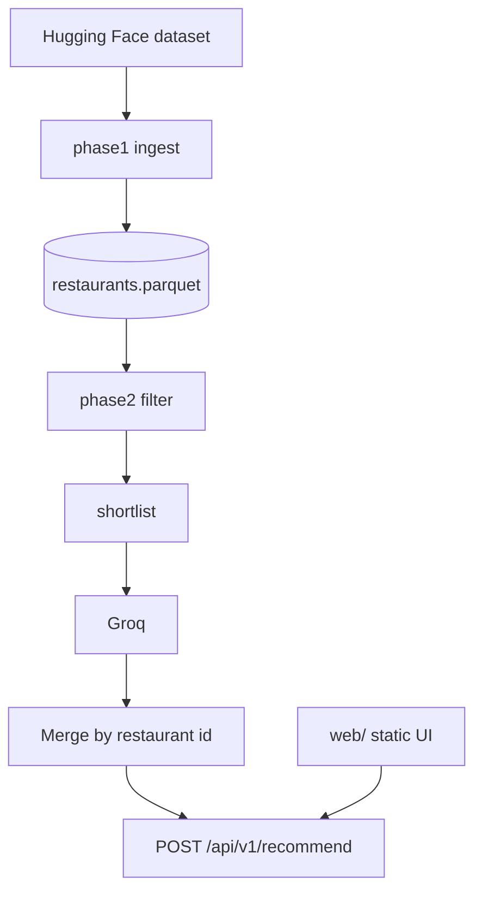

# Architecture (implemented)

This repo implements the **phase-wise** design:

| Phase | Location | Role |
|-------|----------|------|
| 1 | `src/restaurant_rec/phase1/` | HF ingest, canonical schema, validation, Parquet |
| 2 | `src/restaurant_rec/phase2/` | `UserPreferences`, `filter_restaurants`, catalog load |
| 3 | `src/restaurant_rec/phase3/` | Groq prompts, JSON parse, merge LLM ids with catalog facts |
| 4 | `src/restaurant_rec/phase4/app.py` | FastAPI, `/api/v1/*`, static `web/` |

- **Preferences** use numeric **`budget_max_inr`** (max cost for two). Shortlist size is capped by **`filter.max_shortlist_candidates`** in `config.yaml` (not user-controlled).
- **Groq** model and `prompt_version` are non-secret settings in `config.yaml`; **`GROQ_API_KEY`** is only in `.env`.
